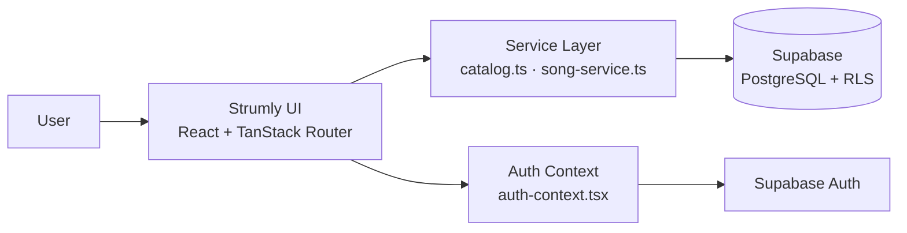

# 🎸 Strumly

### *Every song is closer than you think.*

A modern, guitar-first music platform to discover songs, read lyrics and chords, transpose to any key, and build your own collection.

<br />

**Status:** Active development

**Built with:** React · TypeScript · TanStack Start · TanStack Router · Tailwind CSS · Vite · Supabase · PostgreSQL

---

## 📖 Table of Contents

- [About](#-about)
- [Features](#-features)
- [Tech Stack](#-tech-stack)
- [Architecture](#-architecture)
- [Access Model](#-access-model)
- [Database](#-database)
- [Getting Started](#-getting-started)
- [Environment Variables](#-environment-variables)
- [Project Structure](#-project-structure)
- [Routes](#-routes)
- [Design Language](#-design-language)
- [Security](#-security)
- [Development Workflow](#-development-workflow)
- [Roadmap](#-roadmap)
- [Contributing](#-contributing)
- [License](#-license)
- [Author](#-author)

---

## 🎵 About

**Strumly** brings everything a guitar player needs into one cohesive platform: song discovery, lyrics, chords, key transposition, personal collections, and — eventually — a community-driven library of user-owned content.

Instead of a generic music-player look, Strumly is designed around a **premium, warm, acoustic aesthetic** — deep charcoal, cream, and muted orange tones, with rounded cards, soft shadows, and cinematic imagery.

**The core loop:**

```
Browse → Search → Open a song → Read lyrics & chords → Change key → Play along
```

---

## ✨ Features

### Available now

| Feature | Description |
| --- | --- |
| 🔍 **Song Search** | Search by title, artist, genre, or album |
| 🎚️ **Filter & Sort** | Filter by genre, difficulty, key, and capo; sort by popularity or recently added |
| 🎼 **Song Details** | Metadata, chords, sections, lyrics, tuning, capo, and duration |
| 🔄 **Chord Transposition** | Switch to any target key — computed on the fly, original data stays untouched |
| 🔐 **Authentication** | Email/password signup and login, persistent sessions, logout |
| 🧭 **Auth-aware Navigation** | Shared navbar with profile menu and protected personal routes |
| 🗄️ **Cloud Song Catalog** | Songs served from Supabase PostgreSQL |

### In progress

- 📤 **Song Uploads** — authenticated users submit songs to the catalog
- 🎧 **My Music** — a personal hub for favorites and uploads
- ⚙️ **Account Settings** — profile and account controls

### Planned

- ❤️ **Favorites** — per-user saved songs
- ✏️ **Upload ownership** — view, edit, and delete your own uploads
- 🔑 **Google OAuth** and **password reset**
- 👤 **Profiles table** for extended user information
- 🌐 **Community features**

---

## 🛠 Tech Stack

**Frontend**

- [React](https://react.dev/) + [TypeScript](https://www.typescriptlang.org/)
- [TanStack Start](https://tanstack.com/start) + [TanStack Router](https://tanstack.com/router)
- [Tailwind CSS](https://tailwindcss.com/)
- [Vite](https://vitejs.dev/)

**Backend / Data**

- [Supabase](https://supabase.com/) — cloud backend
- PostgreSQL — primary database
- Supabase Auth — authentication and sessions
- Row Level Security (RLS) — data-level access control

> Strumly is **not** a plain React + Vite app. It is built on TanStack Start and TanStack Router for application structure and routing.

---

## 🏗 Architecture



**Song detail flow**

```
Song selected → /song/:id → song-service → Supabase → metadata + structured content → Song detail page
```

**Chord transposition**

```
Original key → read chords → user selects target key → calculate interval → transpose → display
```

Transposition is a **presentation-level transformation**; stored song data is never modified.

The **service layer** (`src/services/`) keeps database access and song logic separate from UI components.

---

## 🔐 Access Model

Strumly uses **public browsing + authenticated personal features**.

| Capability | Guest | Authenticated |
| --- | :---: | :---: |
| Browse homepage & explore songs | ✅ | ✅ |
| Search, filter, and sort | ✅ | ✅ |
| View song details, lyrics & chords | ✅ | ✅ |
| Transpose chords | ✅ | ✅ |
| My Music (favorites & uploads) | ❌ | ✅ |
| Upload songs | ❌ | ✅ |
| Account settings | ❌ | ✅ |

Guests who try to reach a protected feature are redirected to the login page.

---

## 🗄 Database

The primary table is **`public.songs`**.

| Column | Type | Description |
| --- | --- | --- |
| `id` | `uuid` | Primary key |
| `slug` | `text` | Unique application-level identifier |
| `title` | `text` | Song title |
| `artist` | `text` | Artist name |
| `author` | `text` | Song author (when available) |
| `genre` | `text` | Genre |
| `difficulty` | `text` | Guitar difficulty |
| `song_key` | `text` | Original musical key |
| `capo` | `integer` | Capo position |
| `tuning` | `text` | Guitar tuning (default: `Standard`) |
| `chord_count` | `integer` | Number of chords in the song |
| `popularity` | `integer` | Popularity value |
| `album` | `text` | Album name |
| `art_color` | `text` | Artwork / theme color |
| `lyrics` | `text` | Lyrics / chord content (nullable) |
| `cover_image` | `text` | Cover image reference |
| `added_at` | `date` | Date added |
| `duration` | `text` | Song duration |
| `chords` | `jsonb` | Structured chord information |
| `sections` | `jsonb` | Structured song sections |
| `created_at` | `timestamptz` | Creation timestamp |
| `updated_at` | `timestamptz` | Last update timestamp |

**Design approach** — general metadata is kept separate from structured guitar content:

```
Song
├── Basic Metadata      → title, artist, album, genre, difficulty, popularity
├── Guitar Information  → song_key, capo, tuning, chord_count
└── Structured Content  → chords (JSONB), sections (JSONB), lyrics
```

Using **JSONB** for chords and sections stores rich guitar data without a sprawl of relational tables.

### Migrations

Schema changes live in [`supabase/migrations/`](./supabase/migrations) and are version-controlled with the application.

Example: `20260919_add_song_detail_columns.sql` — adds `duration`, `chords`, and `sections`, plus an index for structured chord data.

### Row Level Security

RLS is enabled. Currently, public users can **read** songs.

```
PUBLIC DATA         → readable by guests and authenticated users
USER-SPECIFIC DATA  → access restricted to the owning authenticated user
```

Policies will be refined as favorites and uploads are implemented, so that users can only modify their own data.

### Planned: favorites

Favorites will be a per-user relationship — **not** a global `isFavorited` flag on `songs`.

```
favorites
├── user_id
└── song_id     (unique per user + song)
```

---

## 🚀 Getting Started

### Prerequisites

- [Node.js](https://nodejs.org/) **or** [Bun](https://bun.sh/)
- [Git](https://git-scm.com/)
- A [Supabase](https://supabase.com/) project

### Installation

```bash
# 1. Clone the repository
git clone https://github.com/shamveelcrx321/Strumly.git
cd Strumly

# 2. Install dependencies
bun install
# or
npm install

# 3. Create your environment file
cp .env.example .env    # or create .env manually (see below)

# 4. Apply the database migrations in supabase/migrations/
#    to your Supabase project

# 5. Start the development server
bun run dev
# or
npm run dev
```

---

## 🔑 Environment Variables

Create a `.env` file in the project root:

```env
VITE_SUPABASE_URL=https://your-project.supabase.co
VITE_SUPABASE_PUBLISHABLE_KEY=your-publishable-key
```

| Variable | Description |
| --- | --- |
| `VITE_SUPABASE_URL` | Your Supabase project URL |
| `VITE_SUPABASE_PUBLISHABLE_KEY` | Supabase **publishable** key (safe for the frontend) |

> ⚠️ **Never** put a Supabase service-role or secret key in any `VITE_` variable, and never commit `.env`.

---

## 📁 Project Structure

```
Strumly/
├── public/                     # Static public assets
├── src/
│   ├── assets/                 # Images and visual assets
│   ├── components/             # Reusable UI (Navbar, AccountDropdown, ...)
│   ├── hooks/                  # Reusable React hooks
│   ├── lib/
│   │   ├── supabase.ts         # Supabase client
│   │   └── auth-context.tsx    # Authentication state
│   ├── routes/                 # File-based routes (TanStack Router)
│   │   ├── __root.tsx
│   │   ├── index.tsx
│   │   ├── search.tsx
│   │   ├── song.$id.tsx
│   │   ├── upload.tsx
│   │   ├── login.tsx
│   │   ├── signup.tsx
│   │   ├── my-music.tsx
│   │   └── settings.tsx
│   ├── services/
│   │   ├── catalog.ts          # Catalog retrieval and processing
│   │   └── song-service.ts     # Song data access
│   ├── router.ts               # Router configuration
│   ├── routeTree.gen.ts        # Generated route tree (keep tracked)
│   ├── server.ts               # Server configuration
│   ├── start.ts                # Startup / middleware configuration
│   └── styles.css
├── supabase/
│   └── migrations/             # Versioned database migrations
├── package.json
├── bun.lock
├── .gitignore
└── README.md
```

> **Note:** `routeTree.gen.ts` is part of the TanStack application structure. Do not delete or ignore it because of the `gen` in its name.

---

## 🧭 Routes

| Route | Purpose | Access |
| --- | --- | --- |
| `/` | Homepage | Public |
| `/search` | Search and song discovery | Public |
| `/song/:id` | Song detail page | Public |
| `/login` | Login | Public |
| `/signup` | Signup | Public |
| `/upload` | Song upload | Authenticated |
| `/my-music` | Favorites and uploads | Authenticated |
| `/settings` | Account settings | Authenticated |

---

## 🎨 Design Language

Strumly aims for a **premium acoustic guitar experience**.

**Palette:** deep charcoal · warm black · cream · beige · peach · muted orange · warm brown · subtle gold

**UI traits:** rounded cards · soft shadows · selective glassmorphism · premium typography · large cinematic imagery · warm gradients

Visual consistency is maintained across Home, Explore, Search, Song Detail, Upload, Login, Signup, My Music, and Settings.

---

## 🛡 Security

1. Never commit `.env`.
2. Never expose Supabase service-role keys.
3. Never put secret keys in `VITE_` environment variables.
4. Use the Supabase **publishable** key on the frontend.
5. Use Row Level Security for user-specific data.
6. Users may only modify resources they own.
7. Keep public song browsing available to guests.
8. Protect personal functionality with authentication.
9. Version-control all database migrations.
10. Never place credentials in source code.

**Note on auth email:** Supabase's default email service has a limited sending rate during development. This limits email delivery only — not the number of users. For production, configure a custom SMTP provider.

---

## 🔄 Development Workflow

```bash
git status
git add .
git commit -m "Describe your changes"
git push origin main
```

**Before considering a feature complete, verify:**

- Homepage loads and navigation works
- Explore and search work
- Song detail pages render correctly
- Transposition produces correct chords
- Login, signup, logout, and protected routes behave correctly

---

## 🗺 Roadmap

- [x] Song catalog migrated to Supabase
- [x] Search, filter, and sort
- [x] Song detail page with chords, sections, and lyrics
- [x] Chord transposition
- [x] Email/password authentication with persistent sessions
- [x] Protected personal routes
- [ ] Song upload flow with user ownership
- [ ] Favorites (per-user, unique per song)
- [ ] My Music (favorites + uploads)
- [ ] Edit and delete own uploads
- [ ] Refined RLS policies for user-owned data
- [ ] Account settings and optional `profiles` table
- [ ] Google OAuth
- [ ] Password reset
- [ ] Custom SMTP for production auth email
- [ ] Community features

---

## 🤝 Contributing

Contributions, ideas, and feedback are welcome.

1. Fork the repository
2. Create a feature branch: `git checkout -b feature/your-feature`
3. Commit your changes: `git commit -m "Add your feature"`
4. Push the branch: `git push origin feature/your-feature`
5. Open a Pull Request

---

## 📄 License

Released under the [MIT License](./LICENSE).

---

## 👤 Author

**Shamveel** — [@shamveelcrx321](https://github.com/shamveelcrx321)

Project repository: [github.com/shamveelcrx321/Strumly](https://github.com/shamveelcrx321/Strumly)

---

